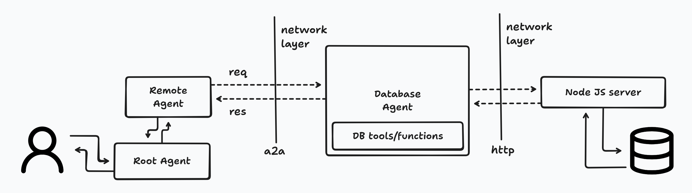
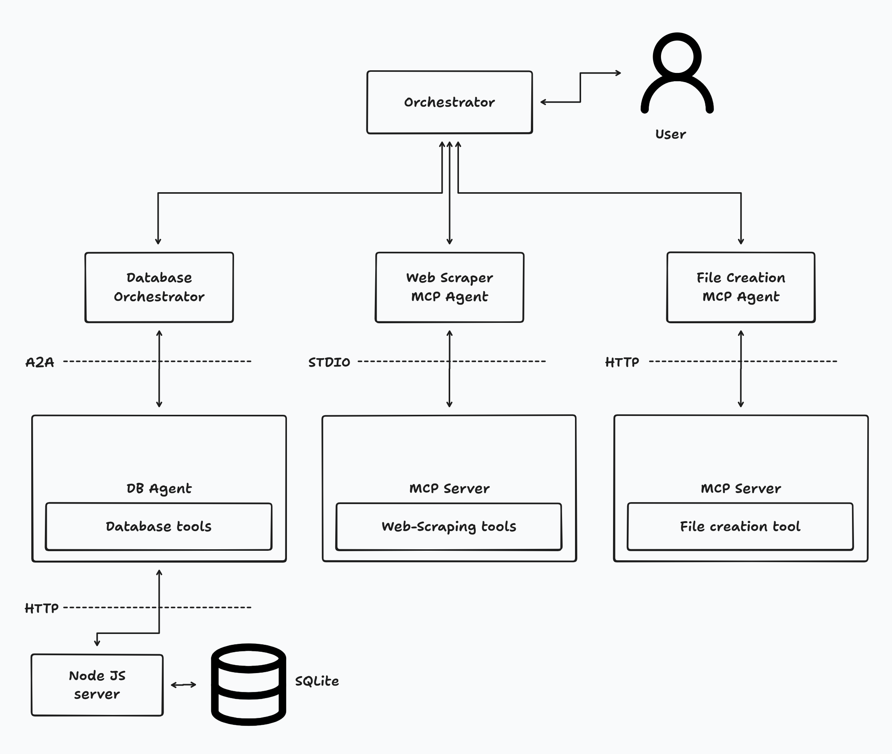

# Learning AI/ML Development

## Example - 2

A toy project implementing A2A Protocol with Google Agent Development kit on local network

## Example - 2

A toy project implementing MCP (stdio), A2A Protocol with ADK

## Example - 3

Implementing MCP over HTTP transport in previus project

Crafted with ♥️ by Ayush Singh
